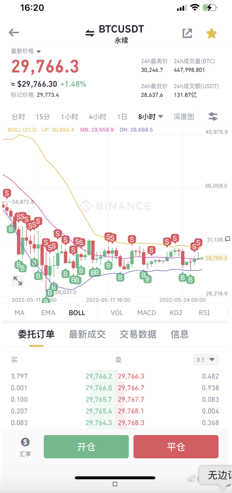

# 赚钱
所以一个人全职做交易的门槛其实差大概在100万u。有这些净资产，在一二线城市买完一套房之后，还可以正常生活，手里面还剩下个200万人民币以上可用于投资。而且这部分投资不需要太激进，投资收益就比你去上班所得要高一点，你的心态也会比较好。所以在你有100万u以前，你还是踏踏实实的上班挣钱，然后二级市场里面该交的学费少交一点，不要有要多期望，坚持小博大就好，不要负债交易。还是那句话，如果你不能让2000块钱变成2万块钱20万块钱，你怎么能保证你借20万就能变成200万，2000万，或者两个亿？        

<!-- more -->

## 币圈
交易员为什么对宏观的行情要有一个大致的判断，因为其实在不同的行情你用的是不同的工具，赚的是不同的钱。

1、在单边向上的行情中，最好的赚钱方式是浮赢加仓，一点点小小的本金就可以赚到很多倍。这是最好的赚钱的方式，一波就可以暴富。
2、在单边向下的行情中，最好的赚钱方式是套保，主要其实就是亏不了多少就好，比别人亏的少跑赢指数就是胜利，裸空容易被一波带走，所以尽量少做。
3、在相对横盘震荡的弱反弹或弱下跌过程中，这属于垃圾行情，可以不做，但如果也要做就是做波动的钱。俗称捡瓶子，就像捡垃圾一样，高频低利润，效益比较低。

> 币圈亏钱指南

小交易所，无法体现。亏。之前有个粉丝被所谓的币圈熟人忽悠冲了10万u进入一个无法体现的交易所。
转错链。甚至转合约地址的。亏。之前有个朋友转了30万u的oec链的usdt去币安。币安2个月没处理了。。就是拖。没办法。
现在有个骗局，就是骗子经常给你钱包空投一1笔，看起来几十万  几百万价值的币，很多人为了卖，授权，然后被盗。亏。不带脑子，天上做梦捡钱。
有人像你出售低价usdt，你为了赚点小利，改天银行卡被冻结。亏。私下交易谨慎。交易所打款，也必须是本人，那种说自己限额，家人给你打款的，注意。
为了看起来 几十万 几百万的年化，冲defi头矿，不思考，亏，利润在，本金跌没了。
不思考 满仓挖矿。谁知道矿跑了。亏
冲土狗，亏，。有人发代码就上，梦想发现一个金狗。

追涨杀跌，亏， 涨了就要追，。跌了就要卖，你不亏谁亏

玩合约，凭感觉开单，亏。不如去赌大小吧。

追热点，但是总是在别人屁股后面，接盘命，。亏。 不如守着自己的币。少瞎搞，多少人花钱买了无用的nft 归0 没流动性

盲目信任人，亏。比如微博大v，你以为很牛逼哦，比如我，炒币菜鸡。。。自己要学会判断和接受 自己的损失才能决定上不上

币，这个东西，必须注意，很多人不看 深度 不看买单。直接市价砸盘亏。。。有时候垃圾币，你卖币，能亏10个点。。

接盘  亏  比如cspr  上火币，私募0.03  很多人根本不管，盲冲。。

搬砖亏。有时候交易所和链上，很多币只是名字一样，其实合约不一样，甚至有些币，自带燃烧，10个点 20个点的。。

撸空投  亏。。空投不是百分之100给的，很多人全部身价去刷。然后不给。，直接内伤。。有心栽花  花不开。能接受的损失去刷。。

私募  亏  自以为 1级市场能赚钱，你不想想，啥私募 啥发财的，能轮到你。。。能发你的币的，一般是垃圾币。。新人别想了。

我觉得，luna这波大家要去做复盘，做空去看你的档案，铸造搬砖去看电侠和南极矿霸，meme看我、puredee、课代表，交易所搬砖看uniswap和我（我发的早但uniswap发的细），是不是就齐活了？

这个市场周期性强，牛短熊长，市值大的品种比如btceth时间拉长还好，受益于美联储外溢流动性影响市值小的就是旁氏的各种变种，是负和博弈。项目方，机构，vC，项目方，交易所对韭菜有绝对优势。牛市的时候是大家一起击鼓传花，大家在这几个月一起齐心协力赚后来的人的钱，这时候竞争不那么内卷，只要后面还有人口红利很容易赚钱。牛市赚钱的人的收益是跨时空的把熊市没跑的人的本金借走了，反过来也是同样。除了btc提供价值储蓄，期货对推，eth提供运营底层平台，其他品种除了博弈价值旁氏价值基本都没有太多意义。以上就是市场运行的基本规律。

核心就是大级别看人口红利和货币周期，小级别看供需量价和情绪。
以上这些道理通过实战理解以后就跑赢市场99%人了，负和市场只要跑的比别人快就难亏钱

赚钱的事情讲完了，讲讲亏钱的。也就是负和博弈里的利润提供方。和别的投机市场一样，不懂市场运行规律，没有仓位管理，风险控制，交易纪律的傻子是利润提供的大头。会有傻逼在smartmoney收网sellsthenews的时候相信故事并在最高点买进去，比如相信马一龙会把狗狗币当成火星货币，相信punkBAYC这些NFT有钱人会跟sb一样每人买一个而且收藏不卖。有其他市场交易经验的人会在比如-10%或者多少亏损的时候止损，但是这些傻子因为听了故事，可能会扛-80%，-90%的亏损，也不懂上面讲的那些比如流动性这样的市场运行规律，然后本金稀里糊涂就没了。
另外一个市场大头的利润提供方是杠杆赌狗。传统金融的杠杆基本只给合格投资人开放，这个市场因为众所周知的没有监管的缘故，100x，甚至1000x的杠杆都很轻易的提供给傻子们。杠杆放大了贪婪与恐惧和手续费，他们又没经验啥也不懂，很容易亏完的以上因素叠加场外借钱杠杆，就是傻子的绞肉机。
了解赌博心理学可知，差点就赚了，本来能赚但是没赚到，赚完没落袋后来亏了，这几种情况会被大脑识别成跟大赚的时候提供一样的多巴胺。然后就跟其他地方赌红眼睛的社会垃圾一样的下场。

### 原理
1，直接打压ust，砸到0.1甚至更低，来回震荡，把搬砖的科学家埋几次，杀鸡儆猴，先别管luna币价 2，用少量钱，1亿美金？10亿美金。差不多，在底部收购ust 3，掌握了大部分ust筹码后，用少量钱维持ust1美金 4，这时候回头再底部建仓luna，也许这个时候luna0.02美金，没人套利砸盘了 先救ust，再救luna

各种所谓的量化策略都是自己适用的场景。

就拿我自己来说，某个币我买了200万刀。我觉得短期波动很大，所以其中有20%，我想拿来做震荡。

我就会开一个做空的变相马丁。就是慢慢加仓卖。(相当于在lp挖矿)肯定有单边风险。

如果卖飞了怎么办，那本来还有80%的币呢。

所以，并不是纯做空。自己看吧，仁者见仁智者见智。有的人喜欢死拿赌大利润。

说说AEX的所谓“高年化收益”从哪里来，以及为什么会暴雷。
一般头部交易所给出的自营理财产品（不标注defi的，比如OJBK余币宝、BN宝和FTX APP）主要来自于资金参与做市分红手续费、撮合借贷、以及平台收入补贴，主流token和稳定币除了少数特殊活动，年化都会控制在10%以内。手续费收入取决于平台要有足够活人玩，撮合借贷取决于平台稳定有活的用户借币，补贴更要求平台有富余资金回馈用户。
显而易见，有能力穿越牛熊提供稳定、可观年化收益的，有且仅有头部平台。其他地方的高年化，都得保持百分之一千的警惕。
再来看看AEX，早已不是比特时代时候的top交易量，平台收入寥寥无几，一个自己都赚不到钱的交易所，凭什么能给出接近20%的稳定币年化？没错，他们自称“Defi”，结果而言被曝光是挪用客户资金参与矿机杠杆挖矿。
什么是矿机杠杆挖矿？首先补充一个小知识，矿机的价格会随实时币价变动，牛市币价高的时候矿机价格飙升，反之深熊则会接近废铁。AEX所做的，就是挪用客户资金先购买一批矿机开始挖矿，然后以这批矿机和挖出的token作为抵押品借出资金，买入更多矿机挖矿，然后再把这批矿机作为抵押品继续借出资金，买入更多矿机...这种被称作矿机杠杆的操作，在牛市能够获得超过100%的大资金年化，收益率堪比辛辛苦苦累死累活天天勤劳做交易的SBF...甚至可以比SBF还牛逼。可惜，这是在牛市。现在，熊市来了，黄天威的裤子就直接被扒光了。他们所谓的拖延90天，不过是在寄希望于三个月后币价和矿机价格能一起涨回去让他们不那么难堪，和拿客户资金赌BTC不会跌破28000结果玩爆仓的三箭资本没多少区别。
就这些小平台的德行，还有谁敢为了所谓高年化迷信小平台？

今年上半年的有一天突然感觉市场很像王者荣耀。

牛市和熊市是两个队在互推，b的每一个整数位都是一座塔，抵抗失败就支撑变阻力。我们在这个市场里无论是投机，投资，还是赌博，都是这盘游戏中参与的玩家。王者荣耀会依据玩家实力给玩家定青铜白银黄金这样的等级，当等级相近的玩家竞技时，这场游戏的竞技水平高度就被称为黄金白银青铜局。

在玩家和行情都有等级的时候，我们可以给市场和玩家分别分类。从青铜，白银，黄金，钻石，星耀，王者，这六个等级中，分别有六种玩家等级和六种市场行情等级。只挣钱不亏钱的秘诀就在于，只打小于等于你水平的行情，只打比你弱的对手，其他时候等着，别在不该打的行情里把本金亏完了。说起来简单，怎么知道现在是什么行情，自己是什么水平呢？

先说行情，在市场中有时候大部分人好挣钱，比如去年1-5月。有时候大部分人不好挣钱，哭爹喊娘的时候，比如今年1-6月。

21年1-5月是明显的青铜局，大单边行情，所有的东西都在涨，所有人都在复投，加杠杆，市场吹出了巨大的泡沫，人人都有巨大的纸面财富，且享受数字继续增长，满足贪婪。b在不断刷新ATH，新人跑步入场，后期开始追逐狗史这种极度泡沫化的产物。在这种低竞技难度的行情下，高手和菜鸡难以拉开收益率的区别，有时候菜鸡胆子大反而挣得比高手更多。这种行情下，一进场立刻浮盈打出成本区，就后悔的是没加够杠杆。所有人希望这样的牛市能永远持续，很少有人在狂欢中提前退场，兑现出金。这时候所有人都很团结，在挣后来的人的钱。

中间三个月小熊市不提，挣没挣到钱你们自己心里有数。去年8-11月小牛有点像白银到黄金局，市场虽然热点多，但是板块轮动很厉害，今天e超越b，明天NFT，后天元宇宙sand mana，大后天链游。高手能在不断换节奏跟热点中挣到钱，菜鸡发现一个个热点追，发现明明市场不错，怎么别的狗b群友都在挣钱，我的本金怎么他妈越来越少了。这时候没有人口红利，你挣的每一分钱都是狗群友兜里掏出来的。

今年尤其3月和6月像是钻石以上的行情。感觉3月是20年以来最难做的一个月，市场在对美联储加息的试探中不断画门，链上机会开始大于风险。4-6月的下跌中基本没有10%以上的反弹，我自己的大级别空单在42和32都没找到反弹入场机会。打开周线惨不忍睹，大部分挣了钱的做空选手也难以抵挡抄底的诱惑，希望自己能成为多空双吃的神。强如一线机构也在这几天的踩踏中上演鲨鱼围猎搁浅鲸鱼的B级片。盈亏同源，财富守恒，这个行情里大部分财富的消失并不是被谁挣走了，这时候财富的凭空消失是在还青铜局凭空创造出来泡沫的债。

下面简单讲讲如何区分自己在什么等级。

黄金是牛市能挣大钱，熊市或者不擅长的行情能认清市场已经变化，不一定最早，但会在还来得及的时候退出，在自己能力以上行情能忍住不动的人。这些人经过多次周期经验，已经对自己什么水平心里有数，能看明白这篇微博讲的是什么。

白银是牛市能跟着前面的人挣钱，熊市不知道跑，盈利还回去，而且本金还水下，亏了不少的人。对市场行情和自己能力基本没概念。这帮人都跌成这样了还会私信问我：企鹅，牛还在吗？

青铜是只能在大牛市赚钱，比特3-6w挣了点钱，6w跌到5w就赔到本金了，5w到4w就亏完甚至还欠债的人。不仅对周期和牛熊完全没有概念，而且没仓位管理和风险控制，对自己啥水平这个问题也从未思考过。

我们中的大部分都在上面三档，下面讲讲黄金以上的玩家，跟你们基本没关系，看看热闹就行了。

王者就是大的一线的项目方交易所vc等降维打击市场的。这帮b通过资金量优势，产业优势，数据优势，信息优势等多种不对称优势的组合碾压市场，旱涝保收。牛市熊市对他们来说意义不大，他们牛市狂赚，熊市小赚。几轮周期下来成了行业里的BAT，诸侯豪杰割据一方，在自己的赛道里有绝对领先地位。

星耀是上一档里的二三四线玩家，对散户仍有绝对优势，牛市挣钱，熊市没啥好办法，反正也死不了，也不会太开心，尽量等熬到牛市。远古巨鲸也算在这一档里。

钻石里开始有游资，CTA，大散户。这些人轮真实交易能力可能比前两档还硬一点，吃的是本事饭。资金量达到一定等级以后，牛市做多，熊市做空，震荡行情有震荡行情挣钱的工具，偶尔圈内有渠道搞点一级，美滋滋。这帮b风险回报比和回撤可能会控制的很好，和金银铜的区别是大部分行情都能挣钱，而且在市场换曲子的时候能快速跟着转换舞步。

希望大家看完心里能有b数，不该玩的行情管住手，一旦跨出两级，你就是战场上送钱的兵线。回本的秘诀就在于苟到属于你的市场难度到来，没到别手贱，吃完记得跑。牢记牛市挣钱的人的收益是从熊市没跑的sb的本金里借来的。

左脚踩右脚升天的系统，在下跌时也会陷入死亡螺旋。519的本质是无限链上清算，这次下跌也是。

很多人只是大概知道什么是清算，不是很明白链上清算的逻辑以及下跌逻辑。简单科普一下

质押率：通常你质押的资产会给定一个质押率，简单说就是值多少钱。以BUSD举例，假设A平台BUSD的质押率是80%，也就是存10000u，当借入的资产价值超过8000u，便会发生清算。

最大安全值：假设质押率是80%，你存入10000u，多数平台并不会一次性让你借价值8000u的资产，因为那样你就直接爆仓清算了。这里我们假设A平台设置最大安全值为90%，这意味着我们一次只能借入10000*0.8*0.9=7200U的ETH。当这些ETH的价值涨到8000u，就发生清算，当然下跌的话就没事。但是因为借币有利益，可能长时间不看，不断产生的利息也会让你的安全值上升到清算。

安全值:通常计算法则为：
1、借入资产总价值/ ∑(质押资产价值*对应资产的质押率)，要求小于1，达到1便发生清算。
2、 ∑(质押资产价值*对应资产的质押率)/借入资产总价值，要求大于1，达到1便发生清算。
对应资产的质押率可以在平台的文档中找到，不同平台的安全值计算法则不尽相同。

清算：和中心化交易所的爆仓不太一样，并不会完全损失自己的全部资产（具体见下方模拟举例）。通常在你存入BUSD时，平台会给你发放一个存款证明，也是一种代币，表示你存了U在我这里。我们假设他叫aBUSD。清算时，清算者(任何人都可以当清算者)通过链上查询发现你这个地址已经质押率已经超过1，那么会调用对应的清算接口（很多年前还能手动，如今都是机器人自动完成）替你还你的借款，同时拿走你的aBUSD。

当然，清算者不是傻子，白白帮lending平台处理坏账。通常平台会设置一个奖励给清算者，比如aave好像是13%。这里我们假设A平台给清算者的奖励是10%，进行一次模拟清算计算。

大冤种S某，在B平台存了1E，价值1000U，E的质押率为80%。他借走了600U，此时安全值为(1000*0.8)/600=1.333。不考虑利息，当ETH跌到600/0.8=750U的时候，他的健康值就等于1了，此时就会发生清算。清算者最多可以帮S还上一半的借贷额度，就是还300U给平台，同时拿走S的(300/750)*1.1=0.44个ETH，这个时候，S的健康值会提升至：((1-0.44)*750)*0.8/(600-300)=1.12。当然，在这一系列过程中，S的损失实际上只有：0.04*750=30U，并不会如爆仓那样全部亏没。当然，清算者的利润也就是30U-gas费。当然之后继续跌，还可以继续发生清算。

正常在发生清算后，如果你是专业的清算者，肯定是把拿到手的E直接砸下去，换成U，把30U稳稳落袋为安。但是这就发生了死亡螺旋：下跌->清算者清算->市价砸盘->继续有账户可以被清算->清算者清算.....

### 套利
套永续+利润定投看跌期权+大跌套季度负溢价

期现：跨所，同所均可，最容易上手的方法，优点简单，易操作，稳定，现货永不爆仓，只需关注一个仓位即可。缺点自然是资金利用率低，效率相对其它几种策略而言不够高。
永续➕杠杆借币：同所，跨所均可，一般跨所。优点资金利用率高，利息相对稳定。缺点杠杆借币手续费相对高，开仓之后调仓不灵活，且行情火热阶段经常借不到币。
永续➕永续：跨所。优点资金利用率高，永续手续费相对低，调仓方便，经常可以利用此方法吃到价差，比如最近的omg就可以在几个知名大所之间来回找机会反复吃（这段时间我去操作别的了，这么大的肉是一口也没吃到）。缺点是对信息发掘的要求相对高，且对冲仓位费率不如杠杆借币稳定。
跨期：一般同所，优点是在升贴水特别夸张的情况下（比如大牛市溢价20%或者519 312这种大暴跌）往往可以在不长的时间抓到一大段价差利润，缺点就是这样的机会非常少，一年可能也就几次，而且很快就结束了，很难抓住。

理解套利原理包括借贷等等，建立机器人

这段时间围猎3ac好多人上头， 我看到有不少人说机构真勾八菜啊。去看看机构的人的简历，一个个qs前50硕博的，人家算微积分比我求个导还快，真有菜的人学习速度也比大多数学习能力不够的人学的快。资金体量不一样做的事情就不一样，3ac进出磨损大平不了仓，大多数人都没体会过没有对手盘的感觉。

可以在ftx上借ust，erc20通过虫洞桥回到terra链（terra链停了），然后ust印luna套利，一次利润100%。有人昨天这么做赚了几千万。

理解各种链，如何跨链，资产分析

地址如何复用映射
交易所的地址规律

重点分析交易所和链上差异，突变来临有哪些套利机会，那些机器人可以提前布置

8月份开始做量化，本来准备两边一个maker，一个taker，为拿maker费率买了155个ftt质押，没想到被动增长了。然后发现maker用不了，还是要两个taker
电子厂小侠博主:你代码不行

做个科普吧。

但凡是要锁仓的，套保都要注意，比方说trx挖sun，o3质押。都是搞死套保的拉升。
但是也不一定会拉，只是说这种锁仓性质的套利挖矿，一定要注意保证金。
然后还有就是借不到币的那种。早期流动性不够的，比方说fil，sol。(关充值肯定算流动性不够)
也要注意现货跟合约的价差。主力就是在合约开多，然后用一点点资金拉升现货就行了[喵喵]
其实昨天ftx跟币安只有5%的时候，就应该过段止损。因为一天2.25%的资金费，也就2天。
而且你要明白一点，你在10刀止损5%。等于你在20刀一天交的资金费。
拉升的越高，不仅保证金很惨，最后资金费也更惨。
最后说真的，你想撸sbf的钱，真的多想想吧。

讲讲今天ok 是怎么撸到的。
先看 这条  http://t.cn/A6XfmOKA
可以知道一些
那么就可以知道，交易所 存在 强行充值。怎么叫强冲呢。
一般交易所 一个链 一个地址。所以 你看不到 luna的地址 看 ust 或者anc的地址一样的
因为他们本质是同一个链
除了一些小交易所，可能存在 一币一地址，不注意就会踩坑
其次，昨天微博，也讲过，交易所，存在 大额充值不能提，或者大额充值不到账
所以 充值 或者提现，可以从小额开始。
今天ok，http://t.cn/A6XfmOK2。从这条微博得出结论。
强冲开始到账，但是看了他的成交记录，发现是小额
所以我自己也开始测试。http://t.cn/A6XcTygy  这是跨链桥
我早上的时候，跨 ust 到 luna链，买luna的。
http://t.cn/A6Me0YSz。这个是上面的dex地址
类似 eth上面的uniswap
0x3d4350cD54aeF9f9b2C29435e0fa809957B3F30a 这个是ust 再bas链的合约地址
ok开了充值，有人说到账，我们就开始测试
步骤就是在 cake  http://t.cn/A6ISKJ63 买了ust通过跨链桥 跨过去。也可以直接买luna 跨

然后争取多买点币。 强冲到ok，，也是测试一波，能不能到账
http://t.cn/A6XfmOKw 最下面可以看见一个充值成功
大概是 100ust 变成了1000u+。利润 100倍+
我就开始 疯狂 冲了。连冲几十笔。。。小额大额，都有，小额到账，大额卡币。。
这样子。。。
前面几天都搬砖，也差不多是这个原理
举一反三就是。也没啥技巧。。无非就是。熟能生巧。。
还有就是  多关注各种信息，多下 个这财经
昨天晚上，链恢复运行多时候，我马上 买 ust。跨链 买luna
充值到 火币出货。。看了下各大交易所，火币可以。。
第一波大概8倍利润。。
后面就不行了。，。
搬砖其实是非常内卷的行为
鉴于现在的影响力，说的多，错的多，也要顾及搬砖佬们的感受
赚钱还是要靠自己。
不懂的，慢慢来吧，小额之类的。。说实话，搬砖也不是 一直赚钱的
如果不带脑子，干啥都是亏钱的。。。。。
币圈很大。。多走出炒币的世界，看看
除了搬砖，其实还有很多玩法，有专门 撸 各种认购的，做套利差价的。等待
白名单，空投啊。抢购啊。。。。。
另外大家不要私聊我，，。。免得。全程充满暗示 要收你群费，割韭菜了。。。。。。。。。。。。
今天把群解散了。。晚点恢复。。
社恐分子，其实真的难。有人说我，我也会难受的，所以我很少和其他大v来往。
别人找我，搞演讲。啥的，我都拒绝了。。
有钱的人也不一定坚强。我脸皮还是比较薄的。。。
感谢大家。

小资金有小资金的好处，大资金有大资金的顾虑，看到不少小资金，最后一刻还在搬砖，获得了巨大利润。

说下我怎么判断退出的。

所有的核心就是韭菜流动性，当最后精度不足的时候，流动性不足，搬砖风险就巨大了。

举个例子，比方说价格是0.0653。每一档深度是跳0.1%。

但是价格到了0.0065。每一档深度是跳1%。

最后跌破0.0010。到了个位数，每一档是跳10%。

因为你买入后充到交易所需要时间，如果流动性不足，这段时间就会暴跌，所以可能亏钱。

包括早上最后币安经常卡链，10%深度只有十几万刀，我就没搬了，并且后面还有太多ust，100万ust。深度不足，都是直接充回去卖的ust的。

不要问为什么不套保，有时候能套，有时候不能套。什么时候不套，也是一门艺术，这次跌的太快太多，让我对套保有了一个新思考。

小资金有小资金的好处，大资金有大资金的顾虑，看到不少小资金，最后一刻还在搬砖，获得了巨大利润。

说下我怎么判断退出的。

所有的核心就是韭菜流动性，当最后精度不足的时候，流动性不足，搬砖风险就巨大了。

举个例子，比方说价格是0.0653。每一档深度是跳0.1%。

但是价格到了0.0065。每一档深度是跳1%。

最后跌破0.0010。到了个位数，每一档是跳10%。

因为你买入后充到交易所需要时间，如果流动性不足，这段时间就会暴跌，所以可能亏钱。

包括早上最后币安经常卡链，10%深度只有十几万刀，我就没搬了，并且后面还有太多ust，100万ust。深度不足，都是直接充回去卖的ust的。

不要问为什么不套保，有时候能套，有时候不能套。什么时候不套，也是一门艺术，这次跌的太快太多，让我对套保有了一个新思考。小资金有小资金的好处，大资金有大资金的顾虑，看到不少小资金，最后一刻还在搬砖，获得了巨大利润。

说下我怎么判断退出的。

所有的核心就是韭菜流动性，当最后精度不足的时候，流动性不足，搬砖风险就巨大了。

举个例子，比方说价格是0.0653。每一档深度是跳0.1%。

但是价格到了0.0065。每一档深度是跳1%。

最后跌破0.0010。到了个位数，每一档是跳10%。

因为你买入后充到交易所需要时间，如果流动性不足，这段时间就会暴跌，所以可能亏钱。

包括早上最后币安经常卡链，10%深度只有十几万刀，我就没搬了，并且后面还有太多ust，100万ust。深度不足，都是直接充回去卖的ust的。

不要问为什么不套保，有时候能套，有时候不能套。什么时候不套，也是一门艺术，这次跌的太快太多，让我对套保有了一个新思考。小资金有小资金的好处，大资金有大资金的顾虑，看到不少小资金，最后一刻还在搬砖，获得了巨大利润。

说下我怎么判断退出的。

所有的核心就是韭菜流动性，当最后精度不足的时候，流动性不足，搬砖风险就巨大了。

举个例子，比方说价格是0.0653。每一档深度是跳0.1%。

但是价格到了0.0065。每一档深度是跳1%。

最后跌破0.0010。到了个位数，每一档是跳10%。

因为你买入后充到交易所需要时间，如果流动性不足，这段时间就会暴跌，所以可能亏钱。

包括早上最后币安经常卡链，10%深度只有十几万刀，我就没搬了，并且后面还有太多ust，100万ust。深度不足，都是直接充回去卖的ust的。

不要问为什么不套保，有时候能套，有时候不能套。什么时候不套，也是一门艺术，这次跌的太快太多，让我对套保有了一个新思考。

目前市面上并没有高频交易的书籍，那么目前正在靠高频交易持续稳定盈利的那批人是从哪里学的？ — 陈大宝 的回答 - 知乎
自学。
我之前一直都是梭哈，生死看淡不服就干。后来有一次和人私聊发现高频交易这么赚钱，恰好我是学计算机的，就顺手写了个算法。
当时我发现了在数字货币里面存在一些特殊的订单，有时候order book刷新的时候会看到一堆整数的买/卖单刷出来，这些单子经常是吃流动性的，而且常在整数价位，我判断是散户弄的。然后我的策略就变成了找到这些单子，做反向操作，然后用一些线性规划的方法来判断涨跌和设立止盈止损。这套策略一开始非常成功，基本上每天入手数万，我还给家里人也用上了这套方法。这有点像高频里面的止损狩猎方法，即狩猎别人的止损单来获利。
但后来散户越来越少，特别是519崩盘以后，这套策略可以说是废了，现在也很难看到散户的单子了。这把让我看到了高频交易的魅力，但这种行情毕竟不可能持续，还是要把基本功练好。
后来我就去研究了一些高频交易的基本方法比如做市和套利。高频套利我做过一段时间，发现这个领域非常非常卷，如果没有很好的返佣和很低的延迟基本上就是去送钱。我当时的策略是在两个平台的永续合约上套利，一边多一边空。具体操作上是在流动性好的一侧开挂单，流动性差的一侧吃单。这样一挂一吃减小手续费消耗同时尽可能避免单腿风险。但最后剧本也一样，一开始很赚钱，后来币价又起来了，各种机构进来玩，我一挂单发现前面有百万大单在排队，成交率直线下降，甚至因为撤单太多被平台警告了。。最后我也弃了这个方法，改做资金费率套利了。当然最后还是弃了，因为负费率的时候会很难受。我现在只做期现套利——先找父母借一大笔钱相当于场外杠杆，然后吃合约套利的那3个点价差，也能挣不少，但是缺点是费爹。
再说说做市吧。因为平台每个月都有成交量要求，所以做市是必要的。我当时做市的基本功很差，基本上就是两侧挂单，不断的被动成交，经常被单边行情打爆。后来给我亏怕了，我就先去写了个模拟盘，先把代码在模拟盘上跑通了再去实盘做。这期间我尝试了很多做市方法，比如经典的avellaneda-stoikov模型。我发现了这些模型虽然没法让你盈利，但是在控制亏损方面很好。于是我索性就默认做市是亏的，然后自己在别的平台开反向单对冲就好了。具体就是先统计一下自己的平均持仓量是多少，然后以这个量为基准上下波动去反向开单。我做的是中低频做市 ，每天的成交量也就1000多单，bid ask差距拉的比较大。现在平均每天还是能小挣100个刀乐，好的时候有上千刀，但这种情况不多，现在我已经很满足了。
我觉得自己在高频交易方面还是没特别入门，现在只能保证不亏，还没到靠它吃饭的水平。练这些东西我也只用了一年时间，主要写的是Python，少量C++。现在市面上很少有直接讲解高频策略的书籍，这个我也比较困惑。有可能是因为这个行业要是细说就全是不足为外人道的东西，所以最好建议还是自己弄个模拟盘先去尝试，等能够稳定赚钱了再去上实盘，当然我的水平比较次，内行人看个乐就好。

### 合约滚仓

就像炒币的时候理论上如何滚仓如何网格，但真正关键的是持仓是交易量是流动性是止盈止损，理论是三角函数求导求极值，现实是离散非周期随机K线，中间有关系但关系不太大。要学好经济多做记录！

唉，看个文章都只能理解一半[允悲]

我从来没说合约不能玩，毕竟我自己都是合约起家的。

我说的是，高杠杆，高杠杆，高杠杆

短线，短线，短线。

能看明白嘛？我以前都是做4h级别，杠杆不会超过5x。一般都在1-3x的

还有一个事。我是靠程序开单和止损的。

我是人，我做不到连续十几次止损，还继续坚持，直到捕获大趋势，赚个3-4倍也不会平仓。

说句实在的，即使用程序，我有时候还会手动干预，主要是回撤的时候太痛苦了[吐]

如果你觉得自己手动可以，那你至少看几本关于交易的书吧？再模仿书上的方法。这样会少走些弯路。

做空是不能浮云加仓的
其实之前解释过
不太精确的计算如下
比特最长来来回回横过几个月
这次是去往20000的下跌中继
目前是半个月应该还要继续反复一段时间
不排除中间可能有反弹到32000-36000一线

认准了既不是单边向上也不是单边向下后
你已经把你开仓的胜率提高了很多
余下赚波动的工具你自己选择一下合适的
虽然也不会每次都对
上次直播观点依然有效有兴趣回看 
微博发的少了一天只发一条
我只是经过思考
认为应该把更多时间留给自己深度思考
而不是全部零碎的分享
然后力求用最简单的文字表达我的想法

如果十倍浮云做多
1块钱涨到10块钱
是2的十次方约1000倍收益
10块钱跌到9块钱跌了10%
只要波动超过1块钱你就亏完了

但是如果浮云做空
10块钱跌到1块钱
同样十倍杠杆
同样是2的十次方约1000倍
还是10%波动你就亏完
但是现在只要波动超过0.1你就亏完了

想对于你做多的开仓价格1块钱
做多爆仓最后波动也是1块钱
是原来价格的100%
但是做空的开仓价格10块钱
做空爆仓波动是0.1元
是原来价格的1%

浮云做多虽然胜率低但赢的是期望值
浮云做空的输的是胜率也没啥期望值
（就算1000倍多空也都是币本位，做空还要除掉币跌的90%其实只有百倍，而做多还要算上币涨的十倍合计10000倍，所以知道为什么做空难赚钱了吗，同样的策略同样的波动多赢钱一次相当于空赢了一百次）

你以为我不想牛市啊
牛市一波浮云做多就可以躺几年
问题是市场不由我啊

本条建议多看几遍

做多和做空收益计算方式是不一样的，做多可以放着不管，做空一定要滚仓。
BN合约有一个计算器，可以给大家说明为什么做空一定要滚仓。
P1：luna从4U腰斩到2U，跌50%，5X做空收益250%，500U
P2：luna从4U空到1U，跌75%，5x做空收益375%，750U
到这里有的朋友已经开始意识到哪里不对了，我们在往下看
P3：luna从4U空到0.5U，跌87.5%，5x做空收益率437.5%，875U
如果滚仓呢？
luna从4U空到2U，关仓，随后从2U重新开仓空到1U，保证金杠杆率都不变，两次腰斩，总收益1000U（P4），再关仓从1U空到0.5U，保证金杠杆率都不变，第三次腰斩，总收益1500U（P5）
如果调整保证金，每一次腰斩之后都滚仓空呢？
luna从4U空到2U，关仓，随后从2U重新开仓空到1U，上一次收益全部转化为保证金，两次腰斩，总收益1750+500=2250U（P6）,再关仓从1U空到0.5U，上一次收益全部转化为保证金，第三次腰斩，总收益6125+1750+500=8375U（P7）
如果不滚仓，当你已经空到1.5U的时候，接下来继续空对你来说已经没有很高的数学期望了，往下到0.5U你只能多一两百U，而一个反弹到2U显然比直接去0.5U更容易，而反弹上去对你收益造成的损失也更大。
如果做多呢？

--“我不平仓，直接利润加仓呢？你那单盈利180w，就是加仓出来的吧”
--“前面的利润没确认，如果反弹回来10%你的损失更大，因为你在低位重新开了大仓而你的利润又遭受回撤，这种习惯不好。你以为你是用利润开的单结果利润全回撤了，相当于你用本金开的单子”

做空的性价比真的很低，不滚仓，收益越来越低，滚仓，风险越来越高。对于新手，不做空，长远看可以活的更久。（PS：U本位，一倍空不滚仓，收益永远不会超过一倍这个常识大家应该知道吧），针对FTX做空进行风险提示：做空一定要用子账户，如果用主账户，做空的是小币种，瞬间插针涨几倍的话，你的主仓位都可能全部爆掉。比如：主仓位抵押币种价值10000u，做空现价2u的共3000u的gmt，如果gmt插针涨到6u以上，持仓的10000u的抵押物就会全部暴掉。（数据为粗略计算）
### 交易
有人问什么叫做T…简单的来说在同一个单子里…根据波动吃5-10刀的差价…会让自己的持仓均价越来越有优势…可以参考下面的两个单子…做T有好几种好处…降低风险，降低均价，利润止盈，其实和股票的当日T类似，但是币圈可以无限T…做空的时候高买低平，做多的时候低买高平，降低自己开仓价格…很容易盈利

我们主要赚趋势的钱，那么，什么时候是趋势最佳切入时机?
1.趋势的中继
上涨之后开始震荡，如果它是一个中继，又继续上涨的话，那么是一个机会。
2.趋势的反转(反弹)
3.震荡的突破。#法师tony语录##比特币超话##投资##财经##币圈##区块链# 

很多人不会小学数学，不理解翻倍出一半的能赚多少，我们来用小学生算法做两个策略计算：
假设有100万本金，不动用杠杆。以狗狗币为例：
1、翻倍出一半，2倍，100万落袋。
2、再翻倍再出一半，4倍，100万落袋。
3、再翻倍再出一半，8倍，100万落袋。
4、再翻倍再出一半，16倍，100万落袋。
5、再翻倍再出一半，32倍，100万落袋。
6、腰斩或跌到1/3，场内的一百万还有33万。
共计533万。五倍多。
有人说，留到现在是16倍，问题是：腰斩的地方一定是32倍么？会不会刚翻倍就腰斩？
激进的1-10-50-100。
1、一倍出一半。100万落袋。
2、十倍再出一半。250万落袋。
3、五十倍再出一半。625万落袋。
这时候，场内还有625万。
中间倍数按本金自我调整，初始总是一倍。

#小饼干的交易知识#  今天聊聊如何构建自己的交易系统
平常的交易中赚钱的始终都是一少部分人，有人偶尔盈利但是保持稳定却很难，所以构建一个交易系统是很重要的
交易系统不是一种方法或者利用某个指标去单独操作，而是综合一些方法和策略&规则，如果你单独靠某个指标去开仓平仓的盈利了，
而且用这个方法盈利和胜率都比较好，但是平常的行情是没办法预测的，也没有完美的交易策略，所以交易上都是亏了赚赚了亏
理论上来说，只要胜率和盈亏比控制好，还是可以赚钱的，但是重点是，我们不是机器人，人都会有自己的性格，都会受情绪的影响，会贪婪会恐惧，在这个状态下
很难理性的去做交易，这也应该是每个交易者都经历过的一步，当自己某一次交易盈利的时候，就会沾沾自喜，觉得下次遇到这种机会还是可以按照之前的办法来做
自我膨胀，随意设置仓位，无视风险，打开APP就开单，或者抄底，还越跌越买，然后就扛单，最后爆仓，爆仓之后就是最冷静的时候
这个时候你就会慢慢复盘  交易策略可以很明确，但是我们自身是很难控制的，所以我们要找一系列的规则来帮助我们自己，让交易更利于自己
交易系统就是针对自己设置出来一系列有利于自己的规则，重点是 这些规则是符合自己的人设和情绪的
下面分享几个大的观点
1 做好风险控制 防止大幅度亏损
这里的重点就是  不要贷款 借钱炒币 拿自己不会受影响的钱去交易市场玩，这几年见过太多贷款借钱炒币的，大部分就是
亏完离场 然后开始漫长的还债之路，交易市场就是赌场，赌的大忌就是贷款和借钱，不要看别人贷款梭哈赚了多少多少
想想自己能承受的起什么样的后果，凡事三思而后行 ，其次就是要设定好每次交易占用本金是多少 最好是总本金3-5%
这样就不会在单次交易里亏太多钱，二是让每次仓位有个固定的计算方法，不那么随意

2 理性思考 选择适合自己的周期交易
我一般看大的周期 比如4H 和日K 周K  大周期的技术分析更可靠，其次不会占用自己太多时间，因为最近挺忙的，一直在做自己的IP
最主要的原因还是 能够控制自己的情绪，让自己有思考的时间  有没有发现 做短线做多了 容易控制不了自己的情绪 因为思考的时间不够多
过度交易也会让自己情绪化 ，所以 做大周期 能让自己更理智 减少看盘

3 给自己信心 多复盘
做好上面的两条后 才值得去思考策略和指标  市场上有太多的指标和策略，自己没有头绪的时候可以选择自己能够理解的指标或者策略去执行
比如非常简单的MACD 移动平均线 布林带 等等 这些 交易所最常见的指标 如果对其他的策略感兴趣 就需要完全学透 再去交易，学习的时候多复盘，然后小资金
去做交易，很多人推荐模拟盘  但是我觉得模拟盘可能不会刺激到自己的心理 ，所以用小资金去尝试那套策略或者指标 比如拿100U玩每次开2U 这样子反复测试，亏了也不心疼 
还有就是，不要捡了芝麻丢了西瓜，每次学习某个指标或者策略的时候，要全部学完，花时间去思考，在去学习下一个，不要一知半解的时候去用常规资金操作，这是很危险的，如果遇到亏损，很可能会让你觉得这个策略和指标没用，然后放弃这个策略
多次尝试后，自己也会有一些复盘数据 如果胜率都不错 就用于实战 实战的时候，资金更大，心理的波动也会随之增大，所以在面临亏损的时候，更要调整好自己的情绪，回想之前测试的时候的练习方法，坚定每次的交易，增加自己的信心，相信自己，回测数据是很枯燥的 需要长时间积累

4 复盘失败的交易
每个阶段的交易都需要复盘，尤其是那些亏损的单，找到问题，避免下次发生错误，同时 一定要多学习，不单单是交易方面的知识，也可以看一些别的书，小说等等，只是为了分散注意力，不需要花太多时间在交易面板上，重点 每天学一点点 无论学什么 或者看什么 都是有意义的，交易是一个循序渐进的过程，需要投入一定的时间和精力才能够达成

5 熊市几点建议
最近自己一直都是在和群友做自己的IP ，以及日常的学习（策划，组织），熊市是完全可以沉淀自己的时候，复盘牛市缺什么，熊市就准备什么，等待下一个牛市的到来，不要浪费熊市的每一刻

跟交易一样  做多靠命 做空靠技术 
这个gmt 你别看很多人都踏空了。
要是技术分析过关.完全不存在踏空 技术分析最好做的阶段,是波动性最强烈的时候 就是从他到顶部后下来一段时间,做技术分析波动是最容易的 这是属于能靠做盘赚的钱 做得久了就会发现,每次在币价达到顶峰后暴跌反弹这段时间,技术分析看的位置可以非常精准

我做空一般有2种方法。

一个是，低波动率的币，直接开大仓位，然后小止损。
要么就是突破追，要么就是在趋势线压制的时候开。

另外一个是，高波动的山寨币，一般是等冲顶后做次高，不出上影线不空，负费率太高不空，然后先开小仓位。等有价格优势后，开始滚仓，就赌螺旋下跌，

做空很难，要赚大利润只能滚仓，不太建议玩合约。可能滚到最后，一个大反弹，全没了。
还有就是，有些人做空会上瘾，等以后牛市来了，也习惯性做空。[汗]

土狗策略
我突然想到了我18年翻身的一次，fomo3d。

我是爆发当天下午进的，那时候eth的价格是250刀吧。池子是4000个eth。

我研究了一下午，判断如下。
1.池子不大，大概4000万刀资金我就能回本。
2.热度没扩散，还算早期。
3.模式非常新颖。

晚上f3d就涨了4倍(玩过都知道，不等于你赚4倍。才刚回本)

然后我瞎几把乱点，发现了p3d。才涨20%。直接满仓梭哈。明显的信息差。(因为在页面的角落里)

盯了一天一夜，一直上涨，最后开始下跌，跌了5%，我就跑了。然后跌了20%，又反弹回去，就开始正式崩盘，基本是最高点。

最后一共赚了2.5倍。

结论就是，我对于盘子模式，进场判断依据。盘子大不大，热度算不算早期，模式算不清新颖。

出场就是崩盘就跑，再也不玩，踏空就算了。[污]

讲一下小资金冲二池的思路。

今天刚开盘的时候冲3000跌到5刀的时候，我开始买，300刀能拉10%吧... 反正买了几次，然后就到10刀了。

然后组了lp。因为lp的池子当时一共就1万刀，我买了1000刀，组成lp占了快20%。。

然后那产量就跟光速一样。不过我后面思路错了，分了一半去搞什么会员和nft碎片，简直跟傻逼一样。其实直接复投二池就行了。

二池的逻辑很简单。一开始apr都是几千万。反正你大概记得，80万apr就是1小时翻倍。所以几分钟就翻倍了。然后一直滚。

在一个就是看池子的大小和流通，开盘1-2小时，流通就20万个。所以赔率很高。

后面当apr降到40万的时候，就是2小时回本，那基本停止复投，开始出货。

然后就是，当开始跌的时候，毫不犹豫走人。[吃瓜]

唉蛮累的，赚的还没有dydx几分钟的波动大。

不过小资金可以参考下。

最后，土狗别上头，别梭哈。没啥意义。拿一半的钱赚10倍，也很多了。梭哈一次归零，就炸了。

算力型交易挖矿（swap）节奏的把握：
昨天bsc上面出现一个神矿，恐龙蛋，是典型的算力型交易挖矿（和mdx和babyswap那种即时型交易挖矿不一样），就是一收菜算力就消失。
我挖过的第一个类似的矿是ok链上的kswap，一言难尽，记忆犹新。
这类算力型交易挖矿swap有两个特点：
1，交易挖矿池是顶级掠食者。
2，流动性二池抛压比一般的不带交易挖矿的swap，抛压更大一些。
不过，这个恐龙蛋还有会员体系和二池nft碎片挖矿，肯定要比kswap要强很多，后面玩法很多。
玩这种交易挖矿，关键要判断币价的台阶，通常有三个台阶。
根据经验，刚开始一个小时价格非常高，可能保持在10几刀，这是第一个台阶；
然后十个小时之后，会跌到3刀左右横盘一段时间，这是第二个台阶；
此后会一直阴跌一两周时间（跌的很慢了，中间有若干次反弹），到一个底部，大约0.5左右（参考拿铁），这是第三个台阶， 后面项目方如果有救市动作，就可能回暖反转了。

那么，交易挖矿具体节奏是这样的：
1，二池刚开始很小，抢交易算力，抓紧时间奋力刷二池的交易量，不要在乎滑点和价格的巨大波动，因为第一个小时收益率极其恐怖。
大概刷一个小时，这个时候价格还能保持在20刀左右，立即收菜，卖掉。大概这一个小时有五倍利润。（不要吝惜算力，因为后面币价掉的比你挖的快）
2，继续拿出刚才卖掉的20%资金复投刷量（就是本金额度），这个时候不要再选二池去刷量，因为摩擦实在太大，价格波动大还经常导致交易失败，这个时候可以慢悠悠的选一个稳定的交易对去刷，刷完等第二个价格台阶形成。
今天早上五点，币价还在2.7刀，第二个币价台阶就到这里结束了，收菜，卖掉，不要吝惜算力，大概有三倍收益。（天亮后砸盘大军就来了）
3，继续拿出刚才卖掉的50%资金去刷量，同样不要选二池，选稳定的交易对，慢悠悠去刷吧。此后，要吝惜算力了，一直不要急着收菜，慢慢等一两周以后，币价见底回升再说。
因为有nft碎片挖矿和开盲盒等玩法，币价见底之后，可能会比较好玩。
1.2 美股/期权
1.3 A股
1.4 出金
如果你有大量的人民币想换外币。或者有大量的外币想换人民币。但是由于外汇管制只有五万美金额度。找地下钱庄肯定是不安全也不合法。私带也违法。安全的低成本的需要一定技术含量。一：开设境外交易账户和银行。二：国内开设期货账户。三：境外账户对冲所有美元的汇率波动风险。四：境外账户和国内账户同时反向交易贵金属，人民币合理合法的对冲到自己的境外了。难度：控制仓位，最好分三笔对冲。方向不要看反，看反方向同时止盈或止损。总资金没有缩水。最大资金波动有可能因为两个市场的微小差距在0.5%。优势：成本远远低于银行买卖差价和手续费。波动既然最高0.5%。可以人为选择在盈利0.5%或者正常价格的时候平仓。最大风险，严重水平不足，导致人民币账户没有对冲的美元账户。反而把美元对冲到人民币账户。弥补办法：多次在交易量最大波动最大的时候。分次逐渐增加仓位。

“之前办的一个案子就是 国内 收钱的和给钱的对冲”

“如果这个方法可行，即是通过你的操作可以保证国外稳定挣钱，国内是否有相应的对冲并不重要，那直接在国外炒期货算了，国内的钱还是不要亏了。唯一要克服的是心理上问题，一个是总数不变无风险的，单边做则不是，不过这通过设置投资策略可以解决。
我本人理解有限，希望答主可以解释一下。”

“是的，如果价格走势能预测准的话，直接开单边头寸了。真正的对冲思维不是内外盘开相反的头寸，而是对冲掉波动率。
比如一个最简单的策略是，外盘用网格交易法赚价格随机游走的钱，内盘买期权对冲极端单边行情的风险。这样外盘靠随机震荡赚钱，内盘交保险费，当然也不可能做到“稳定”，中间可能会有起伏，但长期下来外盘账户的钱是增长的。”

# 英语
## 听力
## 口语
# 健身

# 出海

# 知识面
## 规避小农思想
资产与钱，信用与借记，抠门与大方，内卷与冒险，

买几百万的房子，连 五证 都搞不清楚，
最后房子烂尾了，来一句：老百姓本来就不懂什么五证，我蠢我有理。
买个几十块的雪糕天天说被坑，买几百万的房子连五证都不看。
真的牛逼。

本没必要讲那么多道理，讲 怎么样对自己好，然后还要被喷 不共情，心灾乐祸。

上层人的利益，和下层人的观念都是动不得的，而且上层人利益的来源正是来自下层人的观念，

个体的受损，对大局是有利的，房子烂尾了存款消失了，意味着债务转移了，对我们也是有利的，蠢人算是 给大家做贡献了。

为什么穷人家的孩子难翻身?
1、成熟晚,你没听错,是成熟晩。他们中的大多数要到30多岁的时候才能明白整个社会的运行逻辑和人性。之前俗话总说,穷人家的孩子早当家,其实,那哪里是早当家啊!只不过在极端环境下掌握了一些基本生存技巧而已。
2、没有人帮助指导。一个几代人穷且老实的家庭,在30岁之前人生最大的阻力来自于自己的家人,家人和人脉认知的局限性,会在各种各样的事情上帮倒忙或给出错误的指导。之所以很多穷人家比较叛逆的孩子容易成功,就是因为他们早早就摆脱了家庭的束缚。富裕家庭的孩子,在人生的关键节点上,有人指点那么
几下子,很可能就改变了一生。但穷人家的孩子只能自己摸爬滚打,没有人能帮她,因为上一代人没有足够的认识层次和人脉,不能够给下一代人指引和帮助。
3、没有试错资本。有钱家的孩子,可以试错,不断试,不断成长,实践出真知，一般家庭的孩子或许可以试错一两次,但大部分错一次，就跌入谷底,然后起起伏伏，直到自己撞得头破血流了，尝尽疾苦，才能明白一些规则或积累一点资本,却被社会磨尽了锐气，像可怜的闰土,背负着自己的家庭，跌入轮回的循环。
4、时间成本。认知层次的领悟和传承,资本的积累与继承,都是需要时间的,老鼠的孩子会打洞，穷人家的孩子所有的一切都只能自己花时间去积累,学习,领悟,去提高一些层次，获得一些资本！然而,很多大好的青春岁月和美好的事物就这样消失了，以及没有时间顾及下一代,孩子潜意识造成的缺陷永远难以弥补。别人的顺利，都是上一代人拒绝安稳、拼搏奋斗、不断试错传承来的。

所以穷人的孩子不努力学习考学，不仅是财富积累的不容易,更大的是认识层次难跨越。
## 停止内耗
昨夜梦见在某个地方大学上课，却被转过来热情有人格魅力的老师类似郝俊斌的要求收手机，正在据理力争时候校长听见了过来斯文地说，他这样是对的，你不要自行其是……之后又是零散的一些梦，某个看不上的同学著书还是什么记录自己如何难以退役，而我第一反应是如何撕下或者拍照记录

所以，要如何才能提高自身修养和气场，云淡风轻去和别人争执和自己争执
要确实做到珍惜时间，自由不使用就会浪费掉，自己有多少自由有多少别人没有的条件没有好好用
释放自己，不要消耗自己在没什么意义的看热闹的事情上，按照层次分明剖析一下自己玩手机关注他人热衷国家大事的意义和价值
形成自己的完整的自洽的价值观，不能为特立独行而说，不能虚华无效，要以实际价值和预测性为目标，把握第一性原理，通过学习找到内在规律，如果别人都认为是怎样的，那你坚持己见不能光说别人是无知洗脑的，而是娓娓道来有依据，但是关注的事情不能越过上一条的价值判断

消息源非常重要，戒手机删软件思路不对，应该开拓信息渠道，学会去学习不同的知识才能谈得到优化信息源，现在的问题不是碎片化知识，而是时间消耗在遥控器换台的安抚奶嘴效用上了

昨天跟朋友聊天
他问我为什么日子可以过得如此随性
因为我知道99%的压力会集中在1%的时间内出现
如果剩下的99%时间里不随性
那么真正的压力来临时有够你受的
比如最近的50，打完卖put的打卖call的
你要是看方向这么准那你卖个毛期权
梭哈IH得了
所以，卖期权到底在卖啥？

停止一切消耗你元气、能量、好运的行为：

1. 过度的分析、反复的揣摩一件小事，这会让你本能的认为：我很弱小，我hold不住眼前事。

2. 负面理解别人，把别人想得很坏只会让你认为：这个世界很危险，我必须时刻提防小心才能过得好。这对你来说是一种巨大的、无谓的内耗。
3. 小心思重，容易生气，会纠结在细微的利弊中：只有你在某方面的资源过于匮乏，才一点亏也吃不起，且会因为损失一点利益而纠结很久。

4. 会因为贪恋情绪上的虚假愉悦感，而舍不得离开消耗自己的人，很多女孩的命运转折点都是从这里开始的，之后可能需要长达1到5年的时间走出阴霾。

5. 不学习，不复盘，不思考，总在同一个坑里连续跌倒，无用的情绪太多，理性的思考太少，这种状态很难摆脱厄运。

6. 不要熬夜，要早睡早起，尽量不要在夜里想事情，会徒增很多伤心的情绪，遇到事情的时候好好地睡上一觉，第二天再精神满满地去解决。

7. 要保持健康。这是去年教会我们最重要的一节课，健康地活着是幸福来源的基础。

8. 要正能量，要认识好多积极正能量的朋友，做很多积极向上的事，摆脱极其敏感负能量的一面。

9. 要花多一些心思取悦自己。多打扮打扮自己，做一些自己喜欢的事，培养自信，每天都要告诉自己“你真的很不错”。

10. 要花多些时间陪陪家人和朋友。他们永远是你最坚实的后盾和温暖的港湾，有什么不开心的事，不要憋着，要多多和他们分享，因为他们真的很在意你。

11. 愤怒时说出口的话一定是蠢话，但大家都乐此不疲，放狠话就是发蠢，成年人要学的就是在意识到愤怒上脑的时候在同一时间意识到后果并且自己是否能承担，这点其实不难，难的是大家都把「一时爽」当作了自我诉求。

12. 你现在、将来的漫长岁月里，唯一不会缺席的只有你自己，飞蛾曾扑火那是因为火苗值得，现在飞蛾爱扑日光灯，有点像当代人的爱情，企图撞破但力不从心。

13. 更多的时候，人都在毫无意识里干涉他人的人生并且觉得毫无问题。所有人做所有事，都是自我意识里的「愿意」与否，拿结婚来说，好像大家都在你追我赶，年龄到了该结婚了、喜欢那么久了可以结婚了、两情相悦合适了就去结婚吧，这种看似美好的理由实际上都是在催促他人过生活，无论话说得多么好听。大到结婚、创业、辞职，小到今天吃什么几点吃饭，其要义都取决于「想不想」，而不是「该不该」。

14. 要发自内心地喜欢自己，要享受当下的生活，爱自己对所拥有的一切知足比什么都重要，过得开心自在一点，也不枉来人间走一遭。

15. 不要害怕竞争，不要因为某个领域竞争大就想放弃那个领域。竞争大代表着市场空间大，那些竞争小的领域多数情况不是机会大，而是市场空间小。竞争力的问题比市场空间问题更容易解决，可以通过缩小最小同类项的方式解决，可以通过提升势能的方式解决，也可以通过资源整合的方式解决。

16. 如果不知道自己该如何定位，不知道自己该做什么，那就找一个或几个自己未来想成为的成功者作为标杆和目标。研究这个人或这些人的定位和做法，结合自身情况设计自己的路线和做法，是最正确的策略。千万不要想当然，不要理想主义，不要认为自己比那些成功者更高明。

1. 锻炼身体，身体非常重要。不要去健身房锻炼。着重锻炼以下几项

心肺能力，说白了就是能跑，长跑，短跑的能力。

力量训练，俯卧撑、仰卧起坐、引体向上。

2. 读书。着重读以下的书

外语，好好学主流外语

计算机编程，找一门主流编程语言

中国的交通、地理、政治书，比如山西出什么矿，多少人，多少公路.........

外国的交通、地理、政治书，比如巴黎几个区，多少人口，多少地铁..........

马上，一个铁与血的大时代就要来临了。

当你做完这些准备，时代，会在你面前迷茫。

不要去想自己的苦难，不苦难。不要去想什么原生家庭，阶层固化。人一辈子就一条命。哭死了，原生家庭也不会变成你梦想的家庭，哭瞎了，固化的阶层也不会裂开一个口子，给你一口饭。这些问题，那么多所谓聪明的，有权力的，天天开会的人都解决不了，你，怎么可能解决？

但是，当你的身体强壮到，可以去街上做流氓的时候，你就不怕这些了。不要去做个书生，小确幸，小娘炮，去做个流氓，做个流氓，至少能保证一日三餐。
## 提高思维能力
我最近越发地感受到一点，那就是一个人想要真正深入地了解某项技能，就必须走到定量分析的程度，光靠一些似是而非、大而化之的经验做指导是到不了更深层次的。

例如，我之前一直喜欢玩格斗游戏，并且自以为打《拳皇》的水平很高，那小招连的是咔咔的，不禁自鸣得意起来，后来，我在朋友的介绍下，认识了另外一位打过比赛的高手，中间人建议我们切磋一番，于是我就拿起了手柄，然而，根本就没什么切磋，那完全打成了一场教学赛，我稀里糊涂地就连输了10把，最后高手就笑了，说我对动作帧数的理解完全没有，我一听愣了，心说帧数是啥啊，后来一问我才明白，大概是游戏里每个角色在发招时动作有多少帧，高水平玩家都得背下来，对招数时长得有定量理解，像我之前那种“某招可以连某招”，都属于定性的层面，完全是概而括之的泛泛之谈，上不了台面。

其实不光格斗游戏这样，很多事情都是如此，比如体育，我之前练拳击时，看有的教练团队在比赛前，用仪器跟踪拳手训练时的身体代谢，比赛后又通过录像分析拳手的有效打击次数和防守习惯，总结战术经验，总之方方面面都落实在客观的数据上，相反，另外一些教练团队就完全没有这些分析，训练时就一个劲儿地上量，上强度，运动员伤病概率大增，比赛完就说些什么要“沉着冷静”、“敢打敢拼”之类心态总结，然后就没了，这两种训练方式的差距积累起来，运动员的水平渐渐就不在一个层次了。

所以，当我们觉得自己在某事上水平怪不错时，是真的有客观数据证明自己不错，还是我们仅仅感觉自己不错？我们对此事的观点，到底是只能在感观层面上定性地说个大概，还是能用客观数据予以条理清晰的说明？指导我们的到底是似是而非的迷思，还是黑白分明的现实？以我之见，定性和定量之间横亘的恰恰就是平庸和精专的鸿沟。

之前张笑宇老师和我说，研究问题有个基本原则，叫“一具体就深入”，我深以为然，那怎么才能具体呢？

> **用数学去定量描述。**
