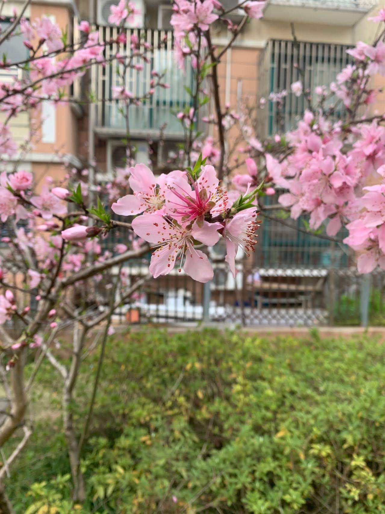

无论是"修齐治平"还是"见自己，见众生，见天地"都觉得只有认识到自己才能再去做更大的事情。但有没有可能，其实见自己才是三重境界最难的，哪怕去过很多地方，见过很多人，做过很多事，却始终不知道自己是谁，自己想要的是什么。或许应该反过来，"见天地，见众生，见自己"，游历天下，知道这个世界的样子，熙熙攘攘都在做什么，也见过形形色色的人，每个人都有自己的打算自己的价值判断，你也知道哪些是可以求存同异和而不同，哪些是自己的坚守，对一件事有自己的判断自己的坚守，再去和光同尘再去活出自我，然后方知我是我，在明灭之间看见本我。

于上海隔离居家办公期间 RYEKEEY@1Apr2022

