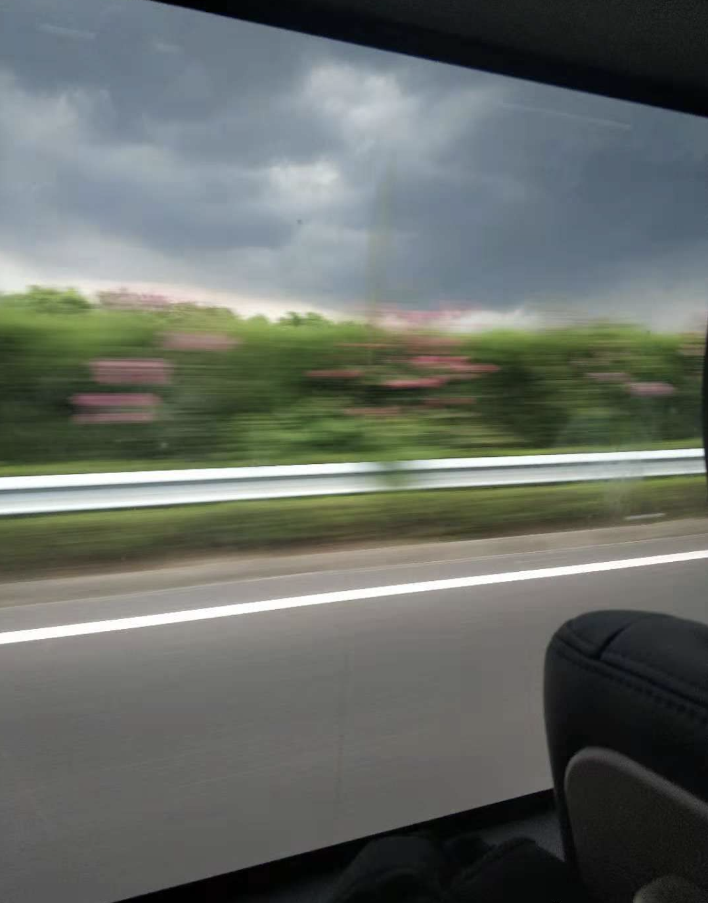

听人说怀念旧时光的人往往当下过得未必如意，而过去则比较好一点，所以才需要在往事的浮光幻影里寻求一点慰藉，也一并发泄几分对世风日下的不满。然而细究起来，说当下不如意或许还算稳妥，过去恐怕未必真的好过现在，只是相比缥缈不定的未来而言，旧时光就算不堪，至少要踏实一些。归根到底，人还是更相信自己经历过的，而怀疑自己没走的路。所以世间多的是前辈的守旧经验之谈，少的是劝年轻人去国离乡的豪情鼓励；多得是步步为营的守成之法，少的是破釜沉舟的冒险人生。而愈是亲近，愈是怕子侄亲朋冒险；愈是陌生，愈是嫌年轻人不敢探索，没有理想。

年轻人呵，多歧路，多歧路，今安在否？    

