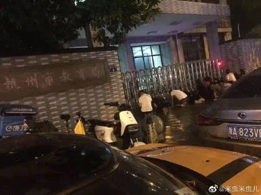
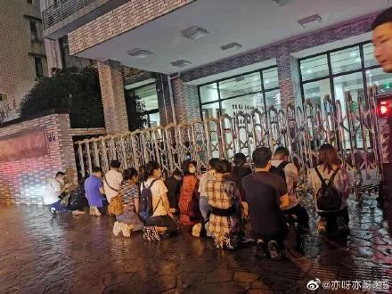
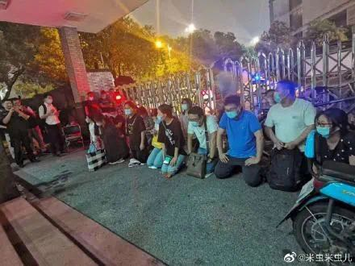

> 怎么说呢，小镇做题家想不通
> 
> 你靠做题刷到了浙大，进了阿里巴巴，5年终于升了p7，花了700万买了79.9平的学军小区学区房里面，然后爹妈亲属投靠帮你带孩子，一家5口新杭州人挤在套内面积60平的房子里玩华容道，鞋柜童车放楼道，你老婆想买个烘干机，结果怎么塞都塞不下。
> 
> 为了还贷，每天加班到11点钟，走了2公里扫了8个单车全是坏的，你想算了还是走回去吧，文一西路灯火通明，路上连个鬼都没有，回到家孩子光着膀子面无表情在努力刷题，你想开空调，妈说别了，我受不了冷。爸躺沙发上外放刷抖音咯咯咯傻乐，回卧室老婆一见你就把手机锁屏说早点睡吧，对了电瓶车没电了你去楼下把电瓶拿上来充个电。一出门就听到隔壁小孩吭哧吭哧砸架子鼓，进电梯看了十秒猿题库的广告，屏幕黑屏的时候你看到了你自己那张做题家的死妈脸。全家排队洗澡结束，睡前你爸妈说过两天回丽水老家住，你想又要迟到接送孩子了本季度3.75无望，想运动一下，掰了半天妻子的肩膀，也没回头。
> 
> 第二天，你骑着电动车跟其他家长一起去反映孩子上不了学的问题，你说我是浙大校友，杭师大毕业的老师怎么能教我的孩子呢？张局，我阿里p7，说起来跟你平级，你必须给我解决上学的问题。突然你回想起来，昨晚睡前你对孩子说，爸妈这辈子就指望你了，但是自己的父母在你小时候也说过同样的话。
> 
> 你一激动，跪下了。
> 
> ———— CR:疑似大咕咕鸡

<!-- more -->

